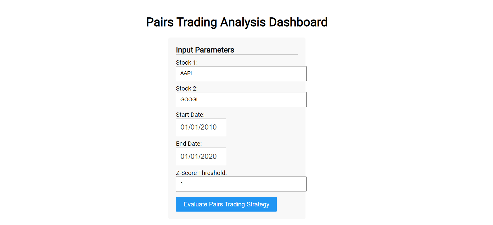

# Quantitative Analysis for Pairs Trading

## Introduction

A Python-based app for quantitative analysis of the pairs trading strategy using cointegration and statistical methods. The project encompasses data acquisition, preprocessing, backtesting, and risk assessment.

Disclaimer: This is a learning project, not a complete system. This project is meant for becoming familiar with trading and risk assessment strategies.
## Table of Contents
1. [Introduction](#introduction)
2. [Features](#features)
3. [Setup & Installation](#setup--installation)
4. [How to Use](#how-to-use)
4. [Sample Results](#sample-results)
5. [Backtesting & Out-of-Sample Testing](#backtesting--out-of-sample-testing)
6. [Future Work & Improvements](#future-work--improvements)
7[Technologies & Libraries Used](#technologies--libraries-used)

## Features

- **Data Fetching**: Fetches historical stock data for any given stock ticker for a specified date range.
- **Preprocessing**: Preprocesses stock data to compute daily returns, handle missing values, etc.
- **Cointegration Testing**: Tests if two stock time series are cointegrated.
- **Results**: Outputs total returns and cumulative rewards for the pairs trading strategies on this data.
- **Risk Assessment**: Calculates key metrics such as Maximum Drawdown and Sharpe Ratio.
- **Trading Strategy Backtesting**: Backtest pairs trading strategies based on cointegration and user-defined z-score thresholds.

## Setup & Installation

1. Clone the repository.
2. Navigate to the repository directory and set up a virtual environment:
`cd QuantPairsTrading`
`python -m venv venv`
`source venv/bin/activate` or `venv\Scripts\activate` on Windows
2. Install dependencies
`pip install -r requirements.txt`
3. Run main_dashboard.py
`$env:PYTHONPATH="PathToQuantAnalysisPairsTrading"`
`python src\visualization\dashboard\main_dashboard.py`

## How to Use

1. Input stock tickers, start and end date as well as a Z-Score Threshold (The Z-score threshold determines the number of standard deviations away from the mean at which a trading signal is generated).
2. Review results, including metrics like Maximum Drawdown, Sharpe Ratio, Total Returns and Cumulative Returns.

## Sample Results

This input will lead to this output:

## Backtesting & Out-of-Sample Testing

For a form of backtesting: 
Select a past data period as your "development" dataset. Optimize the z-threshold for performance.
Record the optimal parameters and performance metrics.

For a form of out-of-sample testing:
Apply these parameters to a subsequent, new data period, your "validation" dataset. 
Comparing performance on this validation dataset to the backtest performance will give you an idea of the strategy's robustness and potential real-world viability.

Limitations:
- Overfitting: Risk of overfitting when manually tweaking parameters, might not generalize well to new data.
- Time-consuming: Manual tweaking of parameters can be time-consuming, it is currently feasible as there is only one parameter but more parameters will be added in the future.

## Future Work & Improvements

- The system is planned to be extended with more parameters that can be optimized and analyzed for performance on the trading strategy, for Pairs Trading this includes different methods for calculating the hedge ratio.
- The system is planned to be extended to support more trading strategies, including mean-reversion strategies and trend-following strategies.

## Technologies & Libraries Used

- **pandas**: Data manipulation and analysis.
- **numpy**: Mathematical operations.
- **statsmodels**: Statistical computations and cointegration testing.
- **yfinance**: Historical financial data.
- **dash**: Dashboard creation.
## Contributors

Eigard Alstad
